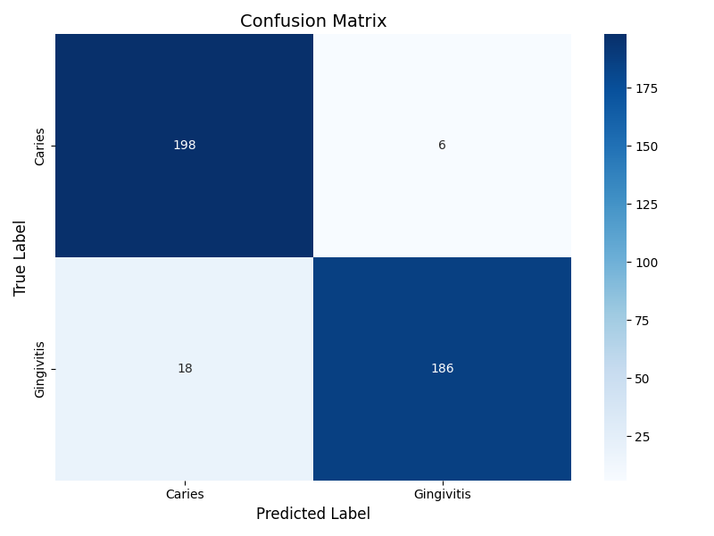

# Oral Disease Classification - Flask Web Application

This is a **Flask web application** that allows users to upload images of oral conditions and predicts whether the disease is **"Caries"** or **"Gingivitis"** using a deep learning model trained with **MobileNetV2**.

---

## Project Overview

Oral diseases such as **Caries** and **Gingivitis** are common health issues. This project demonstrates the use of transfer learning with **MobileNetV2** to classify oral disease images into two categories. A minimalist **Flask web application** is provided for easy interaction and real-time predictions.

**Key Metrics**:
- **Validation Accuracy**: 96.6%
- **Test Accuracy**: 95.1%
  
---

## Features

1. **Image Upload**: Users can upload a dental image through a clean and simple interface.  
2. **Real-Time Prediction**: The app predicts the disease class (Caries or Gingivitis) and displays the confidence score.
3. **User-Friendly Design**: Minimalist interface for easy navigation and seamless interaction.

---

## Technologies Used

- **Python**: Backend programming language.
- **Flask**: Lightweight web framework for building the application.
- **TensorFlow/Keras**: Deep learning framework for model training and prediction.
- **MobileNetV2**: Pre-trained model used for transfer learning.
- **HTML/CSS/JavaScript**: Frontend technologies for building a clean and responsive interface.

---

## How to Run the Project

1. **Set up a virtual environment**:
```bash
python -m venv venv
source venv/bin/activate   # On Windows use: venv\\Scripts\\activate
```

2. **Install required libraries**:
```bash
pip install -r requirements.txt
```

3. **Run the Flask application**:
```bash
python app.py
```

4. **Access the web application**: Open your web browser and go to:
```bash
http://127.0.0.1:5000
```

5. **Test the Application**: Upload a dental image and view the predicted class along with the confidence score.

---

## Folder Structure

The project is organized into the following key directories:

- **models/**: Trained models in .h5 and SavedModel formats.
- **static/**: Temporary storage for uploaded images.
- **templates/**: HTML files for the web app interface.
- **src/**: Python scripts for preprocessing, training, and testing.
- **notebooks/**: Jupyter notebooks used for initial exploration, training, and experimentation.
- **docs/**:
  - **Model Deployment Demo.mp4**: Video demonstrating the Flask web app.
  - **Oral Disease Classification Project Report.pdf**: Detailed project report.
- **app.py**: Main Flask application script.
- **requirements.txt**: Project dependencies.

---

## Model Performance

| Metric                  | Value       |
|-------------------------|-------------|
| **Validation Accuracy** | 96.6%       |
| **Test Accuracy**       | 95.1%       |

#### **Confusion Matrix**

The confusion matrix on the test data demonstrates the classification performance:



- **Caries**:
  - True Positives: 198
  - False Negatives: 6
- **Gingivitis**:
  - True Positives: 186
  - False Negatives: 18

---

## **Insights**

- The model achieved high classification accuracy with minimal false negatives and false positives.
- It performs well on test data, supporting reliable predictions for early diagnosis.

---

## **Future Work**

1. Expand Dataset:
- Add a "Healthy" class to detect images with no disease.
- Increase dataset size by including more diverse data covering different lighting, orientations, and demographics to improve generalization.
2. Enhance Robustness: Add advanced data augmentation techniques such as brightness adjustments, rotations, and noise injection for handling real-world variations.
3. Experiment with Architectures: Test other lightweight architectures like EfficientNet or DenseNet to enhance performance further while maintaining efficiency.

---

## Conclusion

This project successfully demonstrates the potential of deep learning and transfer learning in classifying oral diseases such as Caries and Gingivitis. By leveraging MobileNetV2 and a user-friendly Flask web application, it offers an accessible tool for real-time predictions, aiding healthcare professionals and patients in early diagnosis and treatment planning.

With high accuracy and minimal misclassifications, the model provides reliable results. However, further improvements, such as expanding the dataset for diversity and adding a "Healthy" class, could make the system even more robust and applicable to broader use cases. This project lays the foundation for using AI-driven solutions in dental healthcare, demonstrating both practicality and effectiveness.
